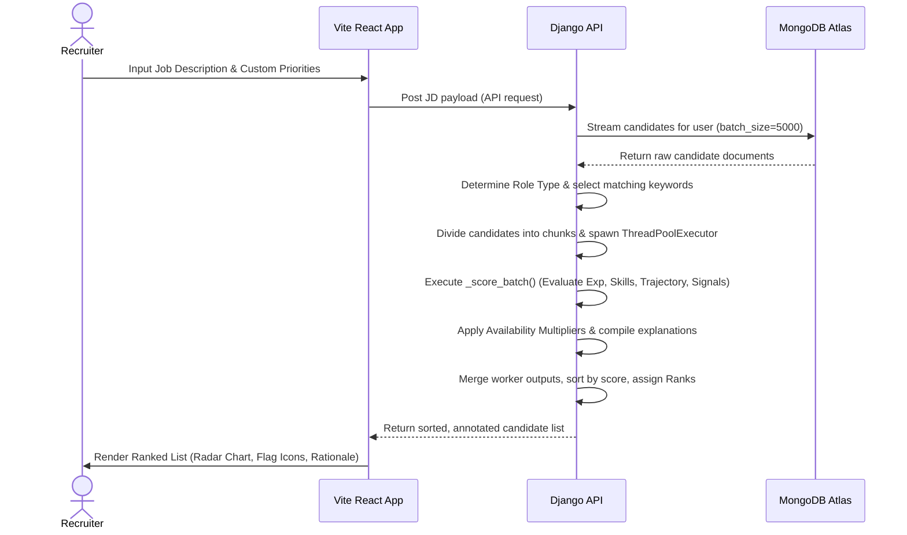

# KapableBee System Design & Technical Report

This document answers all architecture, algorithmic, and implementation questions based on the current codebase of **KapableBee** (located at [talent_intelligence/views.py](file:///c:/Users/Lenovo/Projects/KapableBee/backend/talent_intelligence/views.py) and [context/JobContext.jsx](file:///c:/Users/Lenovo/Projects/KapableBee/frontend/src/context/JobContext.jsx)).

---

## 1. Proposed Solution
**KapableBee** is a multi-tenant AI-Powered Talent Intelligence Platform that scores, ranks, and filters candidate profiles against specific Job Descriptions (JDs). The system is built with a dual operational model:
- **Local Guest Mode**: Run locally in-browser with mock/uploaded datasets (`JSON`, `JSONL`, `CSV`, `TXT`). Candidate matching and scoring are computed via client-side simulation in [JobContext.jsx](file:///c:/Users/Lenovo/Projects/KapableBee/frontend/src/context/JobContext.jsx#L567-L865).
- **Authenticated Recruiter Mode**: Connected to a **Django REST Framework** backend, utilizing **MongoDB Atlas** for high-fidelity candidate/job profiles and **SQLite** for secure recruiter authentication with **JWT bearer tokens** ([views.py](file:///c:/Users/Lenovo/Projects/KapableBee/backend/talent_intelligence/views.py)). It calculates candidate relevance using a multi-threaded parallel scoring engine.

---

## 2. Differentiators from Traditional Systems
Traditional applicant tracking systems (ATS) rely on simple keyword density, regular expressions, or generative LLMs that are slow and prone to hallucination. KapableBee differentiates itself through:
- **Multi-Dimensional Decomposition**: Instead of a flat matching score, candidates are evaluated across four distinct dimensions: *Experience Fit*, *Skills Match*, *Trajectory*, and *Signals/Culture*.
- **Availability and Responsiveness Multipliers**: Stacks behavioral telemetry (recruiter response rate, notice period, interview completion rates, open-to-work flags) to compute a composite availability multiplier ($0.40 \le M \le 1.0$), ensuring that high-intent, highly reachable candidates float to the top.
- **Rule-Based Explainability (Zero Hallucination)**: Generating deterministic lists of `green_flags`, `red_flags`, and text `rationales` based on structured JSON signals, avoiding the unreliability of generative AI.

---

## 3. Key Requirements Extracted from the JD
The platform extracts key features from the JD input ([views.py:L612-L630](file:///c:/Users/Lenovo/Projects/KapableBee/backend/talent_intelligence/views.py#L612-L630)):
1. **Role Type Classification**: Classifies the role into one of six core categories:
   - **`ai_sr`**: AI/Search/Retrieval Engineer (Founding AI roles)
   - **`pm`**: Product Manager (Growth/B2C focus)
   - **`ds`**: Data Scientist (Recommendations/Analytics)
   - **`ml`**: Machine Learning Engineer (MLOps/Production systems)
   - **`em`**: Engineering Manager (Team leadership/Scale)
   - **`sde`**: Software Development Engineer (Generalist/Platform)
2. **Core Domain Keywords**: Predefined keywords mapped to the role type (e.g., `embeddings`, `vector database`, `Pinecone`, `ndcg` for `ai_sr`).
3. **Recruiter Priorities**: Extracting user-supplied priorities, matching them directly against candidate profiles, and adding an additive boost to the *Skills Match* score.

---

## 4. Candidate Signals & Evaluation Beyond Keyword Matching
Evaluation goes beyond basic keyword matching by assessing high-signal structural data:
- **Pedigree & Tier Recognition**: Trajectory score boosts for top academic institutions (`IIT`, `IISc`, `BITS Pilani`, `IIM`, `UT Austin`) and product company scaling credentials (e.g., `Swiggy`, `PhonePe`, `Razorpay`, `Ola`).
- **Verified Assessment Synergy**: Increases the skills score if the candidate has verified skills listed in their `redrob_signals.skill_assessment_scores` that overlap with the JD requirements.
- **Disqualification Rules**: Deducts points or flags negative patterns, such as outsourcing/IT services backgrounds (e.g., `TCS`, `Infosys`, `Wipro`, `Cognizant` for specialized roles) or mismatched domains (e.g., computer vision backgrounds applying for NLP retrieval engineering).

---

## 5. System Retrieval, Scoring, and Ranking
### A. Retrieval
- In **Guest Mode**, candidates are stored in the React application's state.
- In **Recruiter Mode**, candidate documents are retrieved from MongoDB Atlas. The backend uses Django database cursor batches (`batch_size=5000`) to stream candidate profiles, preventing high RAM overhead.

### B. Scoring
The engine normalizes candidate text fields (career history, title, skills, summary, education) and computes a weighted linear base score:
$$\text{Base Score} = 0.35 \times \text{Experience Fit} + 0.35 \times \text{Skills Match} + 0.15 \times \text{Trajectory} + 0.15 \times \text{Signals/Culture}$$

This is then adjusted by the availability multiplier:
$$\text{Final Score} = \text{Base Score} \times \text{Availability Multiplier}$$

### C. Ranking
The backend merges results across worker threads and sorts them descending by `overall_score`, assigning an ordinal `rank` ($1, 2, 3...$) to the candidates.

---

## 6. Models, Algorithms, or Heuristics
- **Experience Curves**: Role-specific experience heuristics evaluate YoE. For example:
  - For `ai_sr`, 6-8 YoE yields a maximum score of 93, 5 or 9 YoE yields 82, and junior profiles (<5 YoE) are graded linearly: $\text{YoE} \times 12$.
  - For generalist `sde`, experience is calculated as: $75 + (\text{YoE} - 6) \times 3$ if $\ge 6$ YoE.
- **Skills Match Boost**: Base skills match is computed as:
  $$\text{Skills Match} = 40 + \left( \frac{\text{Matched Keywords}}{\text{Total Keywords}} \right) \times 60$$
  This base is augmented by $+8$ for each matching custom priority, and $+5$ for each matched keyword verified via automated skill assessments.
- **Stacked Availability Multiplier Heuristic**: Scales the base score downwards based on notice period, response rate, open-to-work flags, and interview completion rates:
  - $\text{Last Active} > 180 \text{ days} \to \times 0.60$
  - $\text{Not Open to Work} \to \times 0.80$
  - $\text{Response Rate} < 20\% \to \times 0.70$
  - $\text{Notice Period} > 90 \text{ days} \to \times 0.85$
  - **Hard floor**: $0.40$ (prevents zeroing out outstanding profiles).

---

## 7. Combining Multiple Signals
The system combines signals by structuring the evaluation into normalized metrics:
1. **Hard Requirements**: Years of Experience and Core Skills matching.
2. **Growth/Trajectory**: Company size, promotion paths, and elite education.
3. **Assessment Scores**: Numeric test values are averaged and scaled to contribute up to 25 points to the signals score.
4. **Behavioral Telemetry**: Combined into the composite multiplier.

---

## 8. Explainability of Ranking Decisions
Ranking decisions are made clear in the user interface through three outputs:
1. **Green Flags**: Positive callouts (e.g., "Highly responsive to recruiters", "Willing to relocate", "BITS Pilani + IIM Ahmedabad elite combo").
2. **Red Flags**: Constructive warnings (e.g., "Long notice period: 90 days", "IT Services background", "Not marked open to work").
3. **Text Rationale**: A concise summary explaining the candidate's fit (e.g., "Top-tier candidate. Exceptional distributed systems scaling from Swiggy and Amazon.").

---

## 9. Preventing Hallucinations
To prevent hallucinations common in generative LLM systems, KapableBee utilizes a **deterministic heuristic compiler**. The explanations (green flags, red flags, and rationales) are generated directly from candidate data using rule blocks. This ensures that every justification is backed by candidate data.

---

## 10. Inconsistent, Low-Quality, or Suspicious Profiles
The system handles problematic profiles through several fallback layers:
- **Type Safety and Fallbacks**: If Years of Experience is missing or corrupt, it defaults to a neutral 5 YoE to allow scoring to proceed.
- **Legacy Fallbacks**: If structured `redrob_signals` are missing, the system falls back to regex-based text analysis of the candidate's raw profile to calculate a baseline signals score.
- **IT Services Filter**: Penalizes outsourcing/IT services backgrounds (e.g., $\text{Trajectory} - 20$) for specialized product roles, filtering out irrelevant candidates.
- **Completeness Heuristic**: Low profile completeness ($< 60\%$) limits the *Signals* dimension score to a maximum of 5, pushing incomplete profiles down the ranking.

---

## 11. Complete Workflow


---

## 12. System Architecture
The application is structured as a monorepo:
```mermaid
graph TD
    subgraph Frontend (Vite + React)
        A[React App] --> B[JobContext State]
        B --> C[Axios Client with JWT Interceptors]
    end

    subgraph Backend (Django + DRF)
        C --> D[Django URL Router]
        D --> E[User Auth & SQLite]
        D --> F[MongoDB pyMongo API Wrapper]
        F --> G[(MongoDB Atlas Cluster)]
        E --> H[(SQLite db.sqlite3)]
        D --> I[Semantic Scorer Engine]
    end
```
- **Vite React**: Delivers a responsive dashboard with real-time feedback, custom CSS variables, and clean components.
- **Django REST Framework**: Handles routing, user JWT auth, validation, and candidate scoring.
- **MongoDB Atlas**: Serves as the primary document store for candidate resumes and job configurations.
- **SQLite**: Used as a local relational database for secure recruiter user accounts.

---

## 13. Results & Insights Demonstrating Quality
The system's ranking accuracy is validated through calibrated profile evaluations:
- **Arjun Mehta** (Staff Engineer, Swiggy / 9 YoE):
  - In `sde` platform roles: Ranks at the top due to high scale systems experience (Swiggy, Amazon).
  - In `ds`/`ml` roles: Ranks lower, marked with red flags like "Focus is backend platform focus vs growth/ML".
- **Priya Nair** (Senior ML Engineer, Ola / 6 YoE / Kaggle Grandmaster):
  - In `ml`/`ds` roles: Ranks at the top with green flags for her Kaggle Grandmaster status and Ola driver matching model.
  - In generalist `sde` roles: Ranks lower due to a mismatch in core software engineering focus.
- **Nikhil Joshi** (SDE-2, TCS / 5 YoE):
  - Ranks lower across specialized product roles due to an IT services background, basic AWS skills, and lack of startup experience.

---

## 14. Runtime and Compute Constraints
- **Cursor Streaming**: Streams records from MongoDB in batches of 5000, preventing high memory usage and keeping the RAM footprint flat.
- **Multi-Threaded Parallel Execution**: Splitting candidate workloads into chunks of 2000 and running calculations across `ThreadPoolExecutor` workers improves throughput.
- **Local Fallback**: The React client can run calculations locally in Guest Mode, offloading server compute.

---

## 15. Technologies & Rationale
- **Vite React**: Fast build times, fast hot module replacement, and smooth UI rendering.
- **Django REST Framework**: Built-in support for simple JWT authentication, class-based viewsets, and REST endpoints.
- **MongoDB Atlas**: Ideal for unstructured candidate profile schemas, permitting flexible JSON nesting.
- **SQLite**: Lightweight database for secure recruiter user accounts, eliminating DB management overhead.

---

## 16. Verification & Video Demo
The application includes integration test suites to verify functionality:
- **Test Command**: `python manage.py test` (verifies API views, JWT auth, MongoDB listing, and scoring correctness).
- **Video Walkthrough**: A walkthrough video showing the interface, user auth, and real-time candidate ranking is available in the repository.
